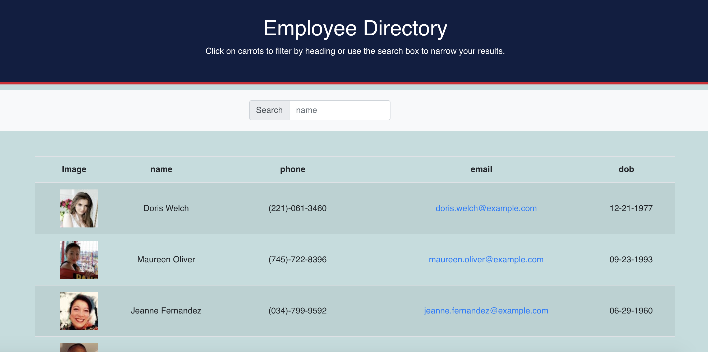
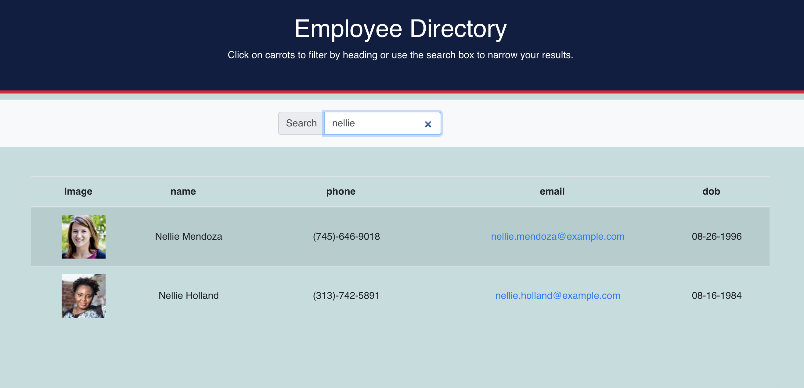

# react-employee-directory

  ## Table of Contents
   * [Description](#Description)
   
   * [`src` Folder ](#src-folder )

   * [Installation and Usage](#installation-and-usage-instructions)
   
   * [Deployed Images](#Deployed-Images)
   
   * [Contribution](#Contribution)
   
   * [Developers Contact Information](#Developers-Contact-Information)
     
  * [License](#license)

## Description
   react-employee-directory is a react app developed based on [RANDOM USER GENERATOR API](https://randomuser.me/). The main objective of this project is to deploy a react prject and manage the dependencies of the different files to each other. This app includes the `package.json`, `public files` and the `src`. The whole project is developed in the `src file` and and rendered to the `public file `mainly the `root div`. 
   ### `src` folder 
   1. `index.js` is file responsible for rendering the app into the public index.html.
   2. `App.js` is file returns a single div with the body wraped in it.
   3. `utils/API.js` is retrives the json data from using axios. 
   4. `components` folder is the main body of the aplication where the diferent jsx files are developed, exported and inported as needed.
 

   ## Installation and Usage Instructions
  You can search an employee by name in [react-employee-directory](https://bbeyenene.github.io/react-employee-directory/). Moreover, the developer is authorizing a free usage and installation by cloning from the code [Bbeyenene/react-employee-directory](https://github.com/Bbeyenene/react-employee-directory).

   ## Deployed Images
   1. Url page
   
   2. Search result
   
   
   ## Contribution
   [Bbeyenene](https://github.com/Bbeyenene) is the only contrubuter to this project.
   
   ## Developers Contact Information
   * LinkdIn Profile: [Berhane](https://www.linkedin.com/in/berhane-beyene/)
   * Deployed URL : [react-employee-directory](https://bbeyenene.github.io/react-employee-directory/) 
   * Email: monoxica2004@yahoo.com
   ## License
   This application is licensed under .
